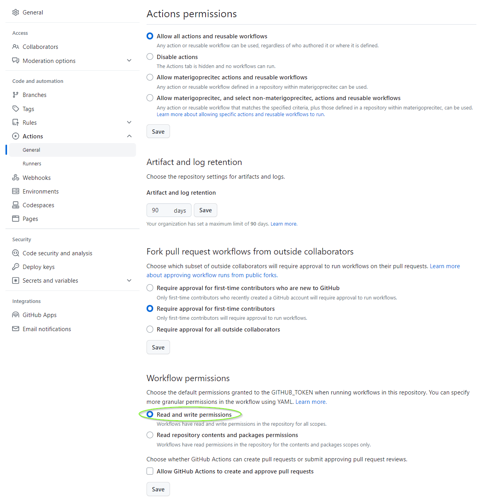

Builds a GDB with enabled python for pretty printing targetting nios.
The executable runs on windows.

The GDB was configured as "--host=x86_64-w64-mingw32 --target=nios2-elf"

It then can replace the original GDB found in the nios installation.
This makes it possible to use pretty printing features, and or to use python scripting while debugging.

Make sure you have the following permssions set in your github repo:

